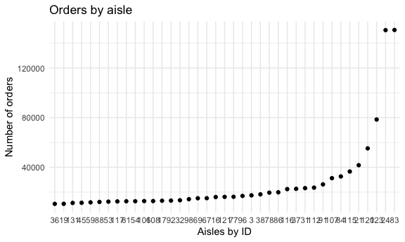
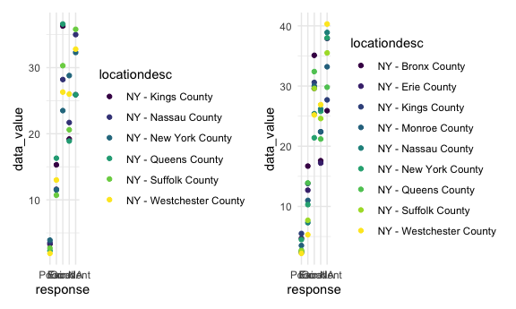
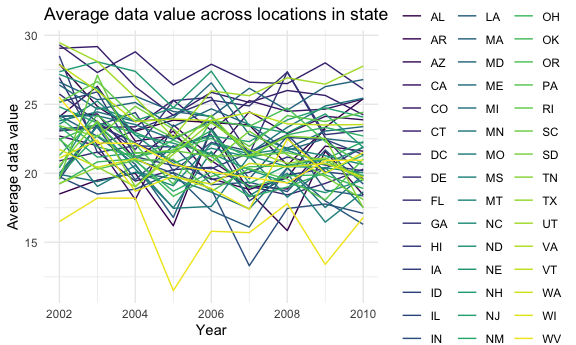
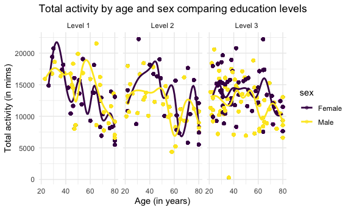
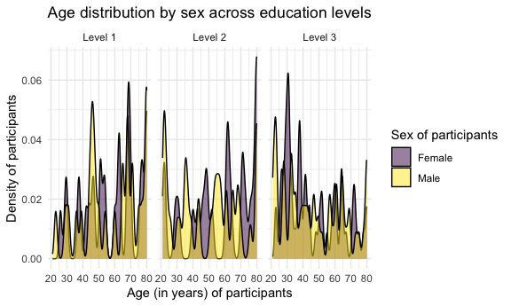
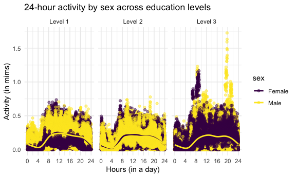

P8105 Homework 3
================
Diana Hernandez
2023-10-14

# Load libraries and settings

``` r
library(tidyverse)
```

    ## ── Attaching core tidyverse packages ──────────────────────── tidyverse 2.0.0 ──
    ## ✔ dplyr     1.1.3     ✔ readr     2.1.4
    ## ✔ forcats   1.0.0     ✔ stringr   1.5.0
    ## ✔ ggplot2   3.4.3     ✔ tibble    3.2.1
    ## ✔ lubridate 1.9.2     ✔ tidyr     1.3.0
    ## ✔ purrr     1.0.2     
    ## ── Conflicts ────────────────────────────────────────── tidyverse_conflicts() ──
    ## ✖ dplyr::filter() masks stats::filter()
    ## ✖ dplyr::lag()    masks stats::lag()
    ## ℹ Use the conflicted package (<http://conflicted.r-lib.org/>) to force all conflicts to become errors

``` r
library(p8105.datasets)

library(patchwork)

knitr::opts_chunk$set(
  fig.width = 6,
  fig.asp = .6,
  out.width = "90%"
)

theme_set(theme_minimal())

options(
  ggplot2.continuous.colour = "viridis",
  ggplot2.continuous.fill = "viridis"
)

scale_colour_discrete = scale_colour_viridis_d
scale_fill_discrete = scale_fill_viridis_d
```

# Problem 1: Instacart

``` r
data("instacart")
```

There are a total of 15 variables. There are 1384617 rows and 15
columns. Examples of key variables include order ID, product ID, user
ID, product name, aisle ID, aisle number, etc.

``` r
instacart_df = 
  instacart
  
instacart_df |>
  group_by(aisle) |>
  summarize(n_obs = n())
```

    ## # A tibble: 134 × 2
    ##    aisle                  n_obs
    ##    <chr>                  <int>
    ##  1 air fresheners candles  1067
    ##  2 asian foods             7007
    ##  3 baby accessories         306
    ##  4 baby bath body care      328
    ##  5 baby food formula      13198
    ##  6 bakery desserts         1501
    ##  7 baking ingredients     13088
    ##  8 baking supplies decor   1094
    ##  9 beauty                   287
    ## 10 beers coolers           1839
    ## # ℹ 124 more rows

There are 134 aisles. The aisles that the most items are ordered from
are: fresh vegetables, fresh fruits, and packaged vegetable fruits.

``` r
instacart_plot = 
instacart_df |>
  filter(n() >= 10000)
  ggplot(instacart_df, aes(x = aisle_id)) + 
  geom_bar() +
  labs(
    title = "Orders by aisle",
    x = "Aisles by ID",
    y = "Number of orders")
```



``` r
instacart_table =
instacart_df |> 
  filter(aisle == c("baking ingredients", "dog food care", "packaged vegetables fruits")) |>
  group_by(aisle, product_name) |> 
  summarize(n_obs = n()) 
```

    ## `summarise()` has grouped output by 'aisle'. You can override using the
    ## `.groups` argument.

# Problem 2: BRFSS

``` r
data("brfss_smart2010")
```

# Data wrangling of brfsss_smart2010

``` r
brfss_smart2010_df = 
  brfss_smart2010 |>
  janitor::clean_names() |>
  select(-location_id) |>
  filter(topic == "Overall Health") |>
  mutate(
    response = factor(response, levels = c("Poor", "Fair", "Good", "Very Good", "Excellent"))
  ) |>
  arrange(response)
```

There are a total of 22 variables. There are 10625 rows and 22 columns.

``` r
locations_2002 = 
brfss_smart2010_df |>
  select(year, locationabbr, locationdesc) |>
  filter(year==2002) |>
  group_by(locationabbr, locationdesc) 

locations_2010 = 
  brfss_smart2010_df |>
  select(year, locationabbr, locationdesc) |>
  filter(year==2010) |>
  group_by(locationabbr, locationdesc) 
```

``` r
excellent_data =
  brfss_smart2010_df |>
  filter(response == "Excellent") |>
  select(year, locationabbr, data_value) |>
  group_by(locationabbr, year) |>
  mutate(
    mean_data_value = mean(data_value, na.rm = TRUE)
  ) 

ggplot(excellent_data, aes(x = year, y = mean_data_value, group = locationabbr, color = locationabbr)) +
geom_line() +
labs(
  title = "Average data value across locations in state",
  x = "Year",
  y = "Average data value",
  color = "Location")
```



The average data value fluctuates by year for most states.

``` r
ny2006_data =
  brfss_smart2010_df |>
  filter(locationabbr == "NY", year == "2006")

ny2006_plot =
ggplot(ny2006_data, aes(x = response, y = data_value, color = locationdesc)) +
  geom_point()

ny2010_data =
  brfss_smart2010_df |>
  filter(locationabbr == "NY", year == "2010")

ny2010_plot =
ggplot(ny2010_data, aes(x = response, y = data_value, color = locationdesc)) +
  geom_point()

ny2006_plot + ny2010_plot
```



2006 and 2010 have a similar distribution of `data_value` for responses
(“Poor” to “Excellent”) among locations in NY State.

# Problem 3: NHANES

# Data wrangling of accelerometer data

``` r
nhanes_accel_data = 
  read_csv("./nhanes_data/nhanes_accel.csv") |>
  janitor::clean_names() |>
  pivot_longer(
    !seqn,
    names_to = "minute",
    names_prefix = "min",
    values_to = "mims"
  )
```

    ## Rows: 250 Columns: 1441
    ## ── Column specification ────────────────────────────────────────────────────────
    ## Delimiter: ","
    ## dbl (1441): SEQN, min1, min2, min3, min4, min5, min6, min7, min8, min9, min1...
    ## 
    ## ℹ Use `spec()` to retrieve the full column specification for this data.
    ## ℹ Specify the column types or set `show_col_types = FALSE` to quiet this message.

# Data wrangling of demographic data

``` r
nhanes_covar_data = 
  read_csv("./nhanes_data/nhanes_covar.csv", skip = 4) |>
  janitor::clean_names() |>
  mutate(
    sex =
      case_match(
        sex,
        1 ~ "Male",
        2 ~ "Female"
        ),
    sex = as.factor(sex),
    education =
      case_match(
        education,
        1 ~ "Level 1",
        2 ~ "Level 2",
        3 ~ "Level 3"
      ),
    education = as.factor(education)
  ) 
```

    ## Rows: 250 Columns: 5
    ## ── Column specification ────────────────────────────────────────────────────────
    ## Delimiter: ","
    ## dbl (5): SEQN, sex, age, BMI, education
    ## 
    ## ℹ Use `spec()` to retrieve the full column specification for this data.
    ## ℹ Specify the column types or set `show_col_types = FALSE` to quiet this message.

# Data merging

``` r
final_nhanes_data =
  full_join(nhanes_covar_data, nhanes_accel_data) |>
  filter(age > 20) |>
  drop_na(sex, age, bmi, education) |>
  mutate(
    sex = as.factor(sex),
    education = as.factor(education)
  )
```

    ## Joining with `by = join_by(seqn)`

``` r
sex_education_table =
  final_nhanes_data |>
  select(sex, education) |>
  group_by(sex, education) |>
  summarize(count = n())
```

    ## `summarise()` has grouped output by 'sex'. You can override using the `.groups`
    ## argument.

``` r
sex_education_table
```

    ## # A tibble: 6 × 3
    ## # Groups:   sex [2]
    ##   sex    education count
    ##   <fct>  <fct>     <int>
    ## 1 Female Level 1   40320
    ## 2 Female Level 2   33120
    ## 3 Female Level 3   84960
    ## 4 Male   Level 1   38880
    ## 5 Male   Level 2   50400
    ## 6 Male   Level 3   80640

``` r
sex_education_plot =
  ggplot(final_nhanes_data, aes(x = education, fill = sex)) +     
  geom_bar(position = position_dodge(), alpha = 0.75) +
  labs(
    title = "Education level by sex",
    x = "Levels of education",
    y = "Number of participants"
  )

sex_education_plot
```



More female participants are in the 3rd level of education compared to
male participants. However, more female participants are in the 1st
level of education compared to male participants as well. There are more
male participants in the 2nd level of education compared to female
participants.

``` r
nhanes_total_activity_data =
  final_nhanes_data |>
  group_by(seqn) |>
  mutate(
    total_activity = sum(mims)
    )

nhanes_total_activity_plot =
  ggplot(nhanes_total_activity_data, aes(x = age, y = total_activity, color = sex)) +
  geom_point(alpha = .5) +
  geom_smooth(se = FALSE) +
  facet_grid(. ~ education) +
  labs(
    title = "Total activity by age and sex across education levels",
    x = "Age (in years)",
    y = "Total activity (in mims)"
  )

nhanes_total_activity_plot
```

    ## `geom_smooth()` using method = 'gam' and formula = 'y ~ s(x, bs = "cs")'



Younger female participants are more active across all levels of
education. Older men are more active in the first level of education,
but less active in both the second and third level of education. Older
women with the highest education are most active among all those with
the highest level of education. In general, activity does fluctuate by
year.

``` r
nhanes_24_hour_data =
  final_nhanes_data |>
  group_by(seqn, minute, mims) |>
  mutate(
    minute = as.numeric(minute),
    mims_by_hour = mims/60, 
    hour = minute/60
    )

nhanes_24_hour_plot =
  ggplot(nhanes_24_hour_data, aes(x = hour, y = mims_by_hour, color = sex)) +
  geom_point(alpha = .5) +
  geom_smooth(se = FALSE) +
  facet_grid(. ~ education) +
  labs(    
    title = "24-hour activity by sex across education levels",
    x = "Hours (in a day)",
    y = "Activity (in mims)"
    ) +
  scale_x_continuous(
    breaks = c(0, 4, 8, 12, 16, 20, 24)
    )
nhanes_24_hour_plot
```

    ## `geom_smooth()` using method = 'gam' and formula = 'y ~ s(x, bs = "cs")'



Male and female participants across education levels and a 24-hour
period have a similar pattern in activity throughout the day. However,
in the highest level of education, there is a greater distribution of
activity over the 24-hour period among both females and males.
