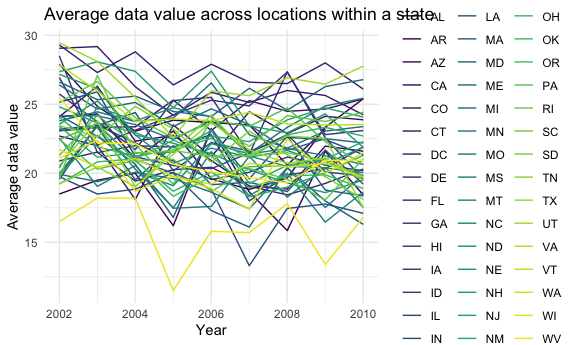

P8105 Homework 3
================
Diana Hernandez
2023-10-14

# Load libraries and settings

``` r
library(tidyverse)
```

    ## ── Attaching core tidyverse packages ──────────────────────── tidyverse 2.0.0 ──
    ## ✔ dplyr     1.1.3     ✔ readr     2.1.4
    ## ✔ forcats   1.0.0     ✔ stringr   1.5.0
    ## ✔ ggplot2   3.4.3     ✔ tibble    3.2.1
    ## ✔ lubridate 1.9.2     ✔ tidyr     1.3.0
    ## ✔ purrr     1.0.2     
    ## ── Conflicts ────────────────────────────────────────── tidyverse_conflicts() ──
    ## ✖ dplyr::filter() masks stats::filter()
    ## ✖ dplyr::lag()    masks stats::lag()
    ## ℹ Use the conflicted package (<http://conflicted.r-lib.org/>) to force all conflicts to become errors

``` r
library(p8105.datasets)

library(patchwork)

knitr::opts_chunk$set(
  fig.width = 6,
  fig.asp = .6,
  out.width = "90%"
)

theme_set(theme_minimal())

options(
  ggplot2.continuous.colour = "viridis",
  ggplot2.continuous.fill = "viridis"
)

scale_colour_discrete = scale_colour_viridis_d
scale_fill_discrete = scale_fill_viridis_d
```

# Problem 1: Instacart

``` r
data("instacart")
```

There are a total of 15 variables. There are 1384617 rows and 15
columns. Examples of key variables include order ID, product ID, user
ID, product name, aisle ID, aisle number, etc.

# Number of aisles and most items ordered from aisles

``` r
instacart_df = 
  instacart |>
  group_by(aisle_id, aisle) |>
  summarize(n_obs = n())
```

    ## `summarise()` has grouped output by 'aisle_id'. You can override using the
    ## `.groups` argument.

There are 134 aisles. The aisles that the most items are ordered from
are: fresh vegetables, fresh fruits, and packaged vegetable fruits.

# Number of items ordered in each aisle

``` r
instacart_plot = 
  ggplot(instacart, aes(x = aisle_id)) + 
  geom_bar() +
  labs(
    title = "Orders by aisle",
    x = "Aisles by ID",
    y = "Number of orders")
```

# Most popular items in “baking ingredients”, “dog food care”, and “packaged vegetables fruits”

``` r
instacart_table =
instacart |> 
  filter(aisle == c("baking ingredients", "dog food care", "packaged vegetables fruits")) |>
  group_by(aisle, product_name) |> 
  summarize(n_obs = n()) 
```

    ## `summarise()` has grouped output by 'aisle'. You can override using the
    ## `.groups` argument.

``` r
instacart_table
```

    ## # A tibble: 1,114 × 3
    ## # Groups:   aisle [3]
    ##    aisle              product_name                                    n_obs
    ##    <chr>              <chr>                                           <int>
    ##  1 baking ingredients 1 to 1 Gluten Free Baking Flour                     5
    ##  2 baking ingredients 1-to-1 Baking Flour, Gluten/Wheat/Dairy Free        2
    ##  3 baking ingredients 100% Cacao Unsweetened Chocolate Baking Bar         3
    ##  4 baking ingredients 100% Natural Sweetener Zero Calorie Packets        16
    ##  5 baking ingredients 100% Natural Zero Calorie Sweetener                 2
    ##  6 baking ingredients 100% Organic Einkorn  All-Purpose Flour             2
    ##  7 baking ingredients 100% Organic Premium Whole Wheat Flour              2
    ##  8 baking ingredients 100% Organic Unbleached All-Purpose Flour           8
    ##  9 baking ingredients 100% Organic Unbleached White Whole Wheat Flour     1
    ## 10 baking ingredients 100% Pure Corn Starch                              22
    ## # ℹ 1,104 more rows

# Pink Lady Apples and Coffee Ice Cream

``` r
apples_coffee_table =
  instacart |> 
  select(product_name, order_hour_of_day, order_dow) |> 
  filter(product_name == c("Pink Lady Apples", "Coffee Ice Cream")) |> 
  group_by(order_dow, order_hour_of_day) |>
  summarize(
    mean_order_hour_of_day = mean(order_hour_of_day, na.rm = TRUE)
  ) 
```

    ## Warning: There was 1 warning in `filter()`.
    ## ℹ In argument: `product_name == c("Pink Lady Apples", "Coffee Ice Cream")`.
    ## Caused by warning in `product_name == c("Pink Lady Apples", "Coffee Ice Cream")`:
    ## ! longer object length is not a multiple of shorter object length

    ## `summarise()` has grouped output by 'order_dow'. You can override using the
    ## `.groups` argument.

# Problem 2: BRFSS

``` r
data("brfss_smart2010")
```

# Data wrangling of brfsss_smart2010

``` r
brfss_smart2010_df = 
  brfss_smart2010 |>
  janitor::clean_names() |>
  select(-location_id) |>
  filter(topic == "Overall Health") |>
  mutate(
    response = factor(response, levels = c("Poor", "Fair", "Good", "Very Good", "Excellent"))
  ) |>
  arrange(response)
```

There are a total of 22 variables. There are 10625 rows and 22 columns.

# 7 or more locations in states in 2002 and 2010

``` r
locations_2002 = 
brfss_smart2010_df |>
  select(year, locationabbr) |>
  filter(year==2002) |>
  count(locationabbr, year, name = "n_obs") |>
  filter(n_obs >= 7) |>
  select(locationabbr)

locations_2010 = 
  brfss_smart2010_df |>
  select(year, locationabbr) |>
  filter(year==2010) |>
  count(locationabbr, year, name = "n_obs") |>
  filter(n_obs >= 7) |>
  select(locationabbr)
```

In 2002, the states that were observed at 7 or more sites are c(“AZ”,
“CO”, “CT”, “DE”, “FL”, “GA”, “HI”, “ID”, “IL”, “IN”, “KS”, “LA”, “MA”,
“MD”, “ME”, “MI”, “MN”, “MO”, “NC”, “NE”, “NH”, “NJ”, “NV”, “NY”, “OH”,
“OK”, “OR”, “PA”, “RI”, “SC”, “SD”, “TN”, “TX”, “UT”, “VT”, “WA”).

In 2010, the states that were observed at 7 or more sites are c(“AL”,
“AR”, “AZ”, “CA”, “CO”, “CT”, “DE”, “FL”, “GA”, “HI”, “IA”, “ID”, “IL”,
“IN”, “KS”, “LA”, “MA”, “MD”, “ME”, “MI”, “MN”, “MO”, “MS”, “MT”, “NC”,
“ND”, “NE”, “NH”, “NJ”, “NM”, “NV”, “NY”, “OH”, “OK”, “OR”, “PA”, “RI”,
“SC”, “SD”, “TN”, “TX”, “UT”, “VT”, “WA”, “WY”).

# Average data_value across locations within a state for ‘Excellent’ responses

``` r
excellent_data =
  brfss_smart2010_df |>
  filter(response == "Excellent") |>
  select(year, locationabbr, data_value) |>
  group_by(locationabbr, year) |>
  mutate(
    mean_data_value = mean(data_value, na.rm = TRUE)
  ) 

ggplot(excellent_data, aes(x = year, y = mean_data_value, group = locationabbr, color = locationabbr)) +
geom_line() +
labs(
  title = "Average data value across locations in state",
  x = "Year",
  y = "Average data value",
  color = "Location")
```



The average data value fluctuates by year for most states.

# Distribution of data_value for responses (“Poor” to “Excellent”) among locations in NY State for 2006 and 2010

``` r
ny2006_data =
  brfss_smart2010_df |>
  filter(locationabbr == "NY", year == "2006")

ny2006_plot =
ggplot(ny2006_data, aes(x = response, y = data_value, color = locationdesc)) +
  geom_point()

ny2010_data =
  brfss_smart2010_df |>
  filter(locationabbr == "NY", year == "2010")

ny2010_plot =
ggplot(ny2010_data, aes(x = response, y = data_value, color = locationdesc)) +
  geom_point()

ny2006_plot + ny2010_plot
```


2006 and 2010 have a similar distribution of `data_value` for responses
(“Poor” to “Excellent”) among locations in NY State.

# Problem 3: NHANES

# Data wrangling of accelerometer data

``` r
nhanes_accel_data = 
  read_csv("./nhanes_data/nhanes_accel.csv") |>
  janitor::clean_names() |>
  pivot_longer(
    !seqn,
    names_to = "minute",
    names_prefix = "min",
    values_to = "mims"
  )
```

    ## Rows: 250 Columns: 1441
    ## ── Column specification ────────────────────────────────────────────────────────
    ## Delimiter: ","
    ## dbl (1441): SEQN, min1, min2, min3, min4, min5, min6, min7, min8, min9, min1...
    ## 
    ## ℹ Use `spec()` to retrieve the full column specification for this data.
    ## ℹ Specify the column types or set `show_col_types = FALSE` to quiet this message.

# Data wrangling of demographic data

``` r
nhanes_covar_data = 
  read_csv("./nhanes_data/nhanes_covar.csv", skip = 4) |>
  janitor::clean_names() |>
  mutate(
    sex =
      case_match(
        sex,
        1 ~ "Male",
        2 ~ "Female"
        ),
    sex = as.factor(sex),
    education =
      case_match(
        education,
        1 ~ "Level 1",
        2 ~ "Level 2",
        3 ~ "Level 3"
      ),
    education = as.factor(education)
  ) 
```

    ## Rows: 250 Columns: 5
    ## ── Column specification ────────────────────────────────────────────────────────
    ## Delimiter: ","
    ## dbl (5): SEQN, sex, age, BMI, education
    ## 
    ## ℹ Use `spec()` to retrieve the full column specification for this data.
    ## ℹ Specify the column types or set `show_col_types = FALSE` to quiet this message.

# Data merging

``` r
final_nhanes_data =
  full_join(nhanes_covar_data, nhanes_accel_data) |>
  filter(age > 20) |>
  drop_na(sex, age, bmi, education) |>
  mutate(
    sex = as.factor(sex),
    education = as.factor(education)
  )
```

    ## Joining with `by = join_by(seqn)`

# Men and women in each education category and their age distribution

``` r
sex_education_table =
  final_nhanes_data |>
  select(sex, education) |>
  group_by(sex, education) |>
  summarize(count = n()) |>
  knitr::kable(digits = 1)
```

    ## `summarise()` has grouped output by 'sex'. You can override using the `.groups`
    ## argument.

``` r
sex_education_table
```

| sex    | education | count |
|:-------|:----------|------:|
| Female | Level 1   | 40320 |
| Female | Level 2   | 33120 |
| Female | Level 3   | 84960 |
| Male   | Level 1   | 38880 |
| Male   | Level 2   | 50400 |
| Male   | Level 3   | 80640 |

``` r
sex_education_age_plot =
  ggplot(final_nhanes_data, aes(x = age, fill = sex)) +     
  geom_density(alpha = .5, adjust = .5) +
  labs(
    title = "Age distribution by sex across education levels",
    x = "Age (in years) of participants",
      y = "Density of participants"
  ) +
  facet_grid(. ~ education) +
  scale_x_continuous(
    breaks = c(10, 20, 30, 40, 50, 60, 70, 80)
  )

sex_education_age_plot
```


More female participants are in the 3rd level of education compared to
male participants. However, more female participants are in the 1st
level of education compared to male participants as well. There are more
male participants in the 2nd level of education compared to female
participants.

# Total activity by sex across education levels

``` r
nhanes_total_activity_data =
  final_nhanes_data |>
  group_by(seqn) |>
  mutate(
    total_activity = sum(mims)
    )

nhanes_total_activity_plot =
  ggplot(nhanes_total_activity_data, aes(x = age, y = total_activity, color = sex)) +
  geom_point(alpha = .5) +
  geom_smooth(se = FALSE) +
  facet_grid(. ~ education) +
  labs(
    title = "Total activity by age and sex across education levels",
    x = "Age (in years)",
    y = "Total activity (in mims)"
  )

nhanes_total_activity_plot
```

    ## `geom_smooth()` using method = 'gam' and formula = 'y ~ s(x, bs = "cs")'


Younger female participants are more active across all levels of
education. Older men are more active in the first level of education,
but less active in both the second and third level of education. Older
women with the highest education are most active among all those with
the highest level of education. In general, activity does fluctuate by
year.

# 24-hour activity time courses by sex over education levels

``` r
nhanes_24_hour_data =
  final_nhanes_data |>
  group_by(seqn, minute, mims) |>
  mutate(
    minute = as.numeric(minute),
    mims_by_hour = mims/60, 
    hour = minute/60
    )

nhanes_24_hour_plot =
  ggplot(nhanes_24_hour_data, aes(x = hour, y = mims_by_hour, color = sex)) +
  geom_point(alpha = .3) +
  geom_smooth(se = FALSE) +
  facet_grid(. ~ education) +
  labs(    
    title = "24-hour activity by sex across education levels",
    x = "Hours (in a day)",
    y = "Activity (in mims)"
    ) +
  scale_x_continuous(
    breaks = c(0, 4, 8, 12, 16, 20, 24)
    )

nhanes_24_hour_plot
```

    ## `geom_smooth()` using method = 'gam' and formula = 'y ~ s(x, bs = "cs")'


Male and female participants across education levels and a 24-hour
period have a similar pattern in activity throughout the day. However,
in the highest level of education, there is a greater distribution of
activity over the 24-hour period among both females and males.
