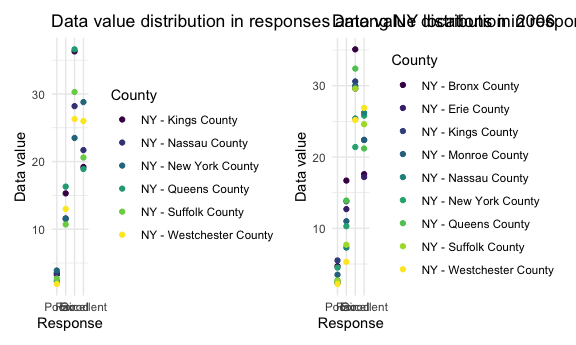
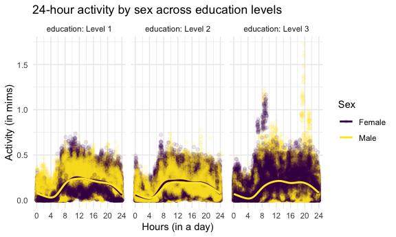

P8105 Homework 3
================
Diana Hernandez
2023-10-14

# Load libraries and settings

``` r
library(tidyverse)
```

    ## ── Attaching core tidyverse packages ──────────────────────── tidyverse 2.0.0 ──
    ## ✔ dplyr     1.1.3     ✔ readr     2.1.4
    ## ✔ forcats   1.0.0     ✔ stringr   1.5.0
    ## ✔ ggplot2   3.4.3     ✔ tibble    3.2.1
    ## ✔ lubridate 1.9.2     ✔ tidyr     1.3.0
    ## ✔ purrr     1.0.2     
    ## ── Conflicts ────────────────────────────────────────── tidyverse_conflicts() ──
    ## ✖ dplyr::filter() masks stats::filter()
    ## ✖ dplyr::lag()    masks stats::lag()
    ## ℹ Use the conflicted package (<http://conflicted.r-lib.org/>) to force all conflicts to become errors

``` r
library(p8105.datasets)

library(patchwork)

knitr::opts_chunk$set(
  fig.width = 6,
  fig.asp = .6,
  out.width = "90%"
)

theme_set(theme_minimal())

options(
  ggplot2.continuous.colour = "viridis",
  ggplot2.continuous.fill = "viridis"
)

scale_colour_discrete = scale_colour_viridis_d
scale_fill_discrete = scale_fill_viridis_d
```

# Problem 1: Instacart

``` r
data("instacart")
```

There are a total of 15 variables. There are 1384617 rows and 15
columns. Examples of key variables include order ID, product ID, user
ID, product name, aisle ID, aisle number, etc.

# Number of aisles and most items ordered from aisles

``` r
instacart_df = 
  instacart |>
  group_by(aisle_id, aisle) |>
  summarize(n_obs = n())
```

    ## `summarise()` has grouped output by 'aisle_id'. You can override using the
    ## `.groups` argument.

There are 134 aisles. The aisles that the most items are ordered from
are: fresh vegetables, fresh fruits, and packaged vegetable fruits.

# Number of items ordered in each aisle

``` r
aisle_df = 
  instacart |>
  count(aisle_id) |>
  filter(n > 10000) |>
  mutate(
    aisle_id = as.factor(aisle_id),
    aisle_id = fct_reorder(aisle_id, n)
  )

aisle_plot =
  ggplot(aisle_df, aes(x = aisle_id, y = n)) + 
  geom_point() +
  labs(
    title = "Orders by aisle",
    x = "Aisles by ID",
    y = "Number of orders")

aisle_plot
```


# Most popular items in “baking ingredients”, “dog food care”, and “packaged vegetables fruits”

``` r
instacart_table =
instacart |> 
  filter(aisle %in% c("baking ingredients", "dog food care", "packaged vegetables fruits")) |>
  group_by(aisle) |> 
  count(product_name) |> 
  mutate(rank = min_rank(desc(n))) |> 
  filter(rank < 4) |> 
  arrange(desc(n)) |>
  select(aisle, product_name, n) |> 
  knitr::kable()

instacart_table
```

| aisle                      | product_name                                  |    n |
|:---------------------------|:----------------------------------------------|-----:|
| packaged vegetables fruits | Organic Baby Spinach                          | 9784 |
| packaged vegetables fruits | Organic Raspberries                           | 5546 |
| packaged vegetables fruits | Organic Blueberries                           | 4966 |
| baking ingredients         | Light Brown Sugar                             |  499 |
| baking ingredients         | Pure Baking Soda                              |  387 |
| baking ingredients         | Cane Sugar                                    |  336 |
| dog food care              | Snack Sticks Chicken & Rice Recipe Dog Treats |   30 |
| dog food care              | Organix Chicken & Brown Rice Recipe           |   28 |
| dog food care              | Small Dog Biscuits                            |   26 |

# Pink Lady Apples and Coffee Ice Cream

``` r
apples_coffee_table =
  instacart |> 
  select(product_name, order_hour_of_day, order_dow) |> 
  filter(product_name %in% c("Pink Lady Apples", "Coffee Ice Cream")) |> 
  group_by(product_name, order_dow) |>
  summarize(
    mean_hour_of_day = mean(order_hour_of_day, na.rm = TRUE)
  ) |>
  pivot_wider(
    names_from = order_dow, 
    values_from = mean_hour_of_day) |>
   knitr::kable(digits = 2)
```

    ## `summarise()` has grouped output by 'product_name'. You can override using the
    ## `.groups` argument.

``` r
apples_coffee_table
```

| product_name     |     0 |     1 |     2 |     3 |     4 |     5 |     6 |
|:-----------------|------:|------:|------:|------:|------:|------:|------:|
| Coffee Ice Cream | 13.77 | 14.32 | 15.38 | 15.32 | 15.22 | 12.26 | 13.83 |
| Pink Lady Apples | 13.44 | 11.36 | 11.70 | 14.25 | 11.55 | 12.78 | 11.94 |

# Problem 2: BRFSS

``` r
data("brfss_smart2010")
```

# Data wrangling of brfsss_smart2010

``` r
brfss_smart2010_df = 
  brfss_smart2010 |>
  janitor::clean_names() |>
  select(-location_id) |>
  filter(topic == "Overall Health") |>
  mutate(
    response = factor(response, levels = c("Poor", "Fair", "Good", "Very Good", "Excellent"))
  ) |>
  arrange(response)
```

There are a total of 22 variables. There are 10625 rows and 22 columns.

# 7 or more locations in states in 2002 and 2010

``` r
locations_2002 = 
brfss_smart2010_df |>
  filter(year==2002) |>
  group_by(locationabbr) |>
  summarize(
    n_obs = n(),
    n_sites = n_distinct(locationdesc)
    ) |>
  filter(n_sites >= 7) |>
  select(locationabbr)

locations_2010 = 
  brfss_smart2010_df |>
  filter(year==2010) |>
  group_by(locationabbr) |>
  summarize(
    n_obs = n(),
    n_sites = n_distinct(locationdesc)
    ) |>
  filter(n_sites >= 7) |>
  select(locationabbr)
```

In 2002, the states that were observed at 7 or more sites are c(“CT”,
“FL”, “MA”, “NC”, “NJ”, “PA”).

In 2010, the states that were observed at 7 or more sites are c(“CA”,
“CO”, “FL”, “MA”, “MD”, “NC”, “NE”, “NJ”, “NY”, “OH”, “PA”, “SC”, “TX”,
“WA”).

# Average data_value across locations within a state for ‘Excellent’ responses

``` r
excellent_data =
  brfss_smart2010_df |>
  filter(response == "Excellent") |>
  select(year, locationabbr, data_value) |>
  group_by(locationabbr, year) |>
  mutate(
    mean_data_value = mean(data_value, na.rm = TRUE)
  ) 
excellent_plot =
  ggplot(excellent_data, aes(x = year, y = mean_data_value, group = locationabbr, color = locationabbr)) +
  geom_line() +
  labs(
    title = "Average data value across locations within a state",
    x = "Year",
    y = "Average data value",
    color = "State"
    )

excellent_plot
```


The `average data value` fluctuates by `year` for most states. The
`average data value` appears to decrease over time.

# Distribution of data_value for responses (“Poor” to “Excellent”) among locations in NY State for 2006 and 2010

``` r
ny2006_data =
  brfss_smart2010_df |>
  filter(locationabbr == "NY", year == "2006") |>
  drop_na(response)

ny2006_plot =
ggplot(ny2006_data, aes(x = response, y = data_value, color = locationdesc)) +
  geom_point() +
  labs(
    title = "Data value distribution in responses among NY locations in 2006",
    x = "Response",
    y = "Data value",
    color = "County"
  )

ny2010_data =
  brfss_smart2010_df |>
  filter(locationabbr == "NY", year == "2010") |>
  drop_na(response)

ny2010_plot =
ggplot(ny2010_data, aes(x = response, y = data_value, color = locationdesc)) +
  geom_point() +
  labs(
    title = "Data value distribution in responses among NY locations in 2010",
    x = "Response",
    y = "Data value",
    color = "County"
  )

ny2006_plot + ny2010_plot
```



`2006` and `2010` have a similar distribution of `data_value` for
responses (“Poor” to “Excellent”) among locations in NY State. `2010`
has more locations within NY state.

# Problem 3: NHANES

# Data wrangling of accelerometer data

``` r
nhanes_accel_data = 
  read_csv("./nhanes_data/nhanes_accel.csv") |>
  janitor::clean_names() |>
  pivot_longer(
    !seqn,
    names_to = "minute",
    names_prefix = "min",
    values_to = "mims"
  )
```

    ## Rows: 250 Columns: 1441
    ## ── Column specification ────────────────────────────────────────────────────────
    ## Delimiter: ","
    ## dbl (1441): SEQN, min1, min2, min3, min4, min5, min6, min7, min8, min9, min1...
    ## 
    ## ℹ Use `spec()` to retrieve the full column specification for this data.
    ## ℹ Specify the column types or set `show_col_types = FALSE` to quiet this message.

# Data wrangling of demographic data

``` r
nhanes_covar_data = 
  read_csv("./nhanes_data/nhanes_covar.csv", skip = 4) |>
  janitor::clean_names() |>
  mutate(
    sex =
      case_match(
        sex,
        1 ~ "Male",
        2 ~ "Female"
        ),
    sex = as.factor(sex),
    education =
      case_match(
        education,
        1 ~ "Level 1",
        2 ~ "Level 2",
        3 ~ "Level 3"
      ),
    education = as.factor(education)
  ) 
```

    ## Rows: 250 Columns: 5
    ## ── Column specification ────────────────────────────────────────────────────────
    ## Delimiter: ","
    ## dbl (5): SEQN, sex, age, BMI, education
    ## 
    ## ℹ Use `spec()` to retrieve the full column specification for this data.
    ## ℹ Specify the column types or set `show_col_types = FALSE` to quiet this message.

# Data merging

``` r
final_nhanes_data =
  full_join(nhanes_covar_data, nhanes_accel_data) |>
  filter(age > 20) |>
  drop_na(sex, age, bmi, education) |>
  mutate(
    sex = as.factor(sex),
    education = as.factor(education)
  )
```

    ## Joining with `by = join_by(seqn)`

# Men and women in each education category and their age distribution

``` r
sex_education_table =
  final_nhanes_data |>
  select(sex, education) |>
  group_by(sex, education) |>
  summarize(count = n()) |>
  knitr::kable(digits = 1)
```

    ## `summarise()` has grouped output by 'sex'. You can override using the `.groups`
    ## argument.

``` r
sex_education_table
```

| sex    | education | count |
|:-------|:----------|------:|
| Female | Level 1   | 40320 |
| Female | Level 2   | 33120 |
| Female | Level 3   | 84960 |
| Male   | Level 1   | 38880 |
| Male   | Level 2   | 50400 |
| Male   | Level 3   | 80640 |

``` r
sex_education_age_plot =
  ggplot(final_nhanes_data, aes(x = age, fill = sex)) +     
  geom_density(alpha = .5, adjust = .5) +
  labs(
    title = "Age distribution by sex across education levels",
    x = "Age (in years) of participants",
    y = "Density of participants",
    fill = "Sex of participants"
  ) +
  facet_grid(. ~ education) +
  scale_x_continuous(
    breaks = c(10, 20, 30, 40, 50, 60, 70, 80)
  )

sex_education_age_plot
```


The highest density for both female and male participants within the
third level of education is the younger age group ranging from 20 to 30
years old. The highest densities for female participants within the
second level of education is in the older age group ranging from 60 to
80 years old. However, for the male participants within the second level
of education, the highest density is among the younger population.
Within the first level of education, the density increases with age for
female participants. The highest density for male participants within
the first level of education is in the middle-aged group ranging from 40
to 50 years old.

# Total activity by sex across education levels

``` r
nhanes_total_activity_data =
  final_nhanes_data |>
  group_by(seqn) |>
  mutate(
    total_activity = sum(mims)
    )

nhanes_total_activity_plot =
  ggplot(nhanes_total_activity_data, aes(x = age, y = total_activity, color = sex)) +
  geom_point(alpha = .5) +
  geom_smooth(se = FALSE) +
  facet_grid(. ~ education) +
  labs(
    title = "Total activity by age and sex across education levels",
    x = "Age (in years)",
    y = "Total activity (in mims)",
    color = "Sex"
  )

nhanes_total_activity_plot
```

    ## `geom_smooth()` using method = 'gam' and formula = 'y ~ s(x, bs = "cs")'


Younger female participants are more active across all levels of
education compared to younger male participants. Older men are more
active in the first level of education, but less active in both the
second and third level of education. Older women with the highest
education are most active compared to younger women and men, in general.

# 24-hour activity time courses by sex over education levels

``` r
nhanes_24_hour_data =
  final_nhanes_data |>
  group_by(seqn) |>
  mutate(
    minute = as.numeric(minute),
    mims_by_hour = mims/60, 
    hour = minute/60
    )

nhanes_24_hour_plot =
  ggplot(nhanes_24_hour_data, aes(x = hour, y = mims_by_hour, color = sex)) +
  geom_point(alpha = .1) +
  geom_smooth(se = FALSE) +
  facet_grid(. ~ education) +
  labs(    
    title = "24-hour activity by sex across education levels",
    x = "Hours (in a day)",
    y = "Activity (in mims)",
    color = "Sex"
    ) +
  scale_x_continuous(
    breaks = c(0, 4, 8, 12, 16, 20, 24)
    )

nhanes_24_hour_plot
```

    ## `geom_smooth()` using method = 'gam' and formula = 'y ~ s(x, bs = "cs")'



Male and female participants across education levels and a 24-hour
period have a similar pattern in activity throughout the day. However,
in the highest level of education, there is a greater distribution of
activity over the 24-hour period among both females and males.
