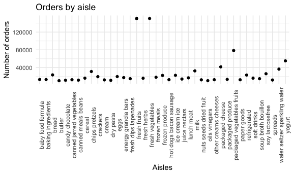

P8105 Homework 3
================
Diana Hernandez
2023-10-14

# load tidyverse, setting options, and p8105.datasets

``` r
library(tidyverse)
```

    ## ── Attaching core tidyverse packages ──────────────────────── tidyverse 2.0.0 ──
    ## ✔ dplyr     1.1.3     ✔ readr     2.1.4
    ## ✔ forcats   1.0.0     ✔ stringr   1.5.0
    ## ✔ ggplot2   3.4.3     ✔ tibble    3.2.1
    ## ✔ lubridate 1.9.2     ✔ tidyr     1.3.0
    ## ✔ purrr     1.0.2     
    ## ── Conflicts ────────────────────────────────────────── tidyverse_conflicts() ──
    ## ✖ dplyr::filter() masks stats::filter()
    ## ✖ dplyr::lag()    masks stats::lag()
    ## ℹ Use the conflicted package (<http://conflicted.r-lib.org/>) to force all conflicts to become errors

``` r
library(p8105.datasets)

library(patchwork)

knitr::opts_chunk$set(
  fig.width = 6,
  fig.asp = .6,
  out.width = "90%"
)

theme_set(theme_minimal())

options(
  ggplot2.continuous.colour = "viridis",
  ggplot2.continuous.fill = "viridis"
)

scale_colour_discrete = scale_colour_viridis_d
scale_fill_discrete = scale_fill_viridis_d
```

# Problem 1: Instacart

``` r
data("instacart")
```

There are a total of 15 variables. There are 1384617 rows and 15
columns. Examples of key variables include order ID, product ID, user
ID, product name, aisle ID, aisle number, etc.

``` r
instacart_df = 
  instacart
  
instacart_df |>
  group_by(aisle) |>
  summarize(n_obs = n())
```

    ## # A tibble: 134 × 2
    ##    aisle                  n_obs
    ##    <chr>                  <int>
    ##  1 air fresheners candles  1067
    ##  2 asian foods             7007
    ##  3 baby accessories         306
    ##  4 baby bath body care      328
    ##  5 baby food formula      13198
    ##  6 bakery desserts         1501
    ##  7 baking ingredients     13088
    ##  8 baking supplies decor   1094
    ##  9 beauty                   287
    ## 10 beers coolers           1839
    ## # ℹ 124 more rows

There are 134 aisles. The aisles that the most items are ordered from
are: fresh vegetables, fresh fruits, and packaged vegetable fruits.

``` r
instacart_plot = 
instacart_df |>
  filter(n() >= 10000)
  ggplot(instacart_df, aes(x = aisle_id)) + 
  geom_bar() +
  labs(
    title = "Orders by aisle",
    x = "Aisles by ID",
    y = "Number of orders")
```



``` r
instacart_table =
instacart_df |> 
  filter(aisle == c("baking ingredients", "dog food care", "packaged vegetables fruits")) |>
  group_by(product_name, aisle) |> 
  summarize(count = n()) 
```

    ## `summarise()` has grouped output by 'product_name'. You can override using the
    ## `.groups` argument.

# Problem 2: BRFSS

``` r
data("brfss_smart2010")
```

# Data cleaning

``` r
brfss_smart2010_df = 
  brfss_smart2010 |>
  janitor::clean_names() |>
  select(-location_id) |>
  filter(topic == "Overall Health") |>
  mutate(
    response = factor(response, levels = c("Poor", "Fair", "Good", "Very Good", "Excellent"))
  ) |>
  arrange(response)
```

There are a total of 22 variables. There are 10625 rows and 22 columns.

``` r
excellent_data =
  brfss_smart2010_df |>
  filter(response == "Excellent") |>
  select(year, locationabbr, data_value) |>
  group_by(locationabbr, year) |>
  mutate(
    mean_data_value = mean(data_value, na.rm = TRUE)
  ) 

ggplot(excellent_data, aes(x = year, y = mean_data_value, group = locationabbr, color = locationabbr)) +
geom_line() +
labs(
  title = "Average data value across locations in state",
  x = "Year",
  y = "Average data value",
  color = "Location")
```


The average data value fluctuates by year for most states.

``` r
ny2006_data =
  brfss_smart2010_df |>
  filter(locationabbr == "NY", year == "2006")

ny2006_plot =
ggplot(ny2006_data, aes(x = response, y = data_value, color = locationdesc)) +
  geom_point()

ny2010_data =
  brfss_smart2010_df |>
  filter(locationabbr == "NY", year == "2010")

ny2010_plot =
ggplot(ny2010_data, aes(x = response, y = data_value, color = locationdesc)) +
  geom_point()

ny2006_plot + ny2010_plot
```


2006 and 2010 have a similar distribution of `data_value` for responses
(“Poor” to “Excellent”) among locations in NY State.

# Problem 3: NHANES

``` r
nhanes_accel_data = 
  read_csv("./nhanes_data/nhanes_accel.csv") |>
  janitor::clean_names() 
```

    ## Rows: 250 Columns: 1441
    ## ── Column specification ────────────────────────────────────────────────────────
    ## Delimiter: ","
    ## dbl (1441): SEQN, min1, min2, min3, min4, min5, min6, min7, min8, min9, min1...
    ## 
    ## ℹ Use `spec()` to retrieve the full column specification for this data.
    ## ℹ Specify the column types or set `show_col_types = FALSE` to quiet this message.

``` r
nhanes_covar_data = 
  read_csv("./nhanes_data/nhanes_covar.csv", skip = 4) |>
  janitor::clean_names() |>
  mutate(
    sex =
      case_match(
        sex,
        1 ~ "Male",
        2 ~ "Female"),
    sex = as.factor(sex)
  ) 
```

    ## Rows: 250 Columns: 5
    ## ── Column specification ────────────────────────────────────────────────────────
    ## Delimiter: ","
    ## dbl (5): SEQN, sex, age, BMI, education
    ## 
    ## ℹ Use `spec()` to retrieve the full column specification for this data.
    ## ℹ Specify the column types or set `show_col_types = FALSE` to quiet this message.
